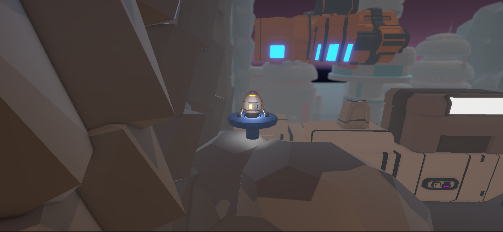
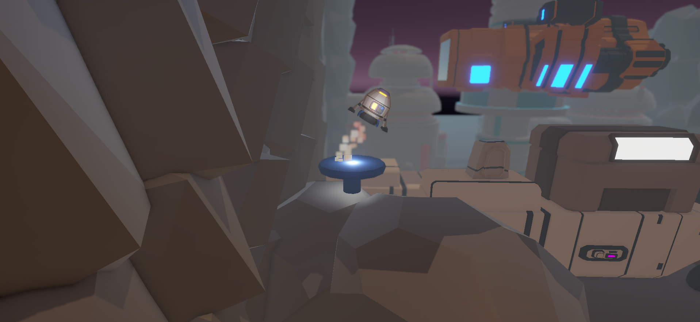
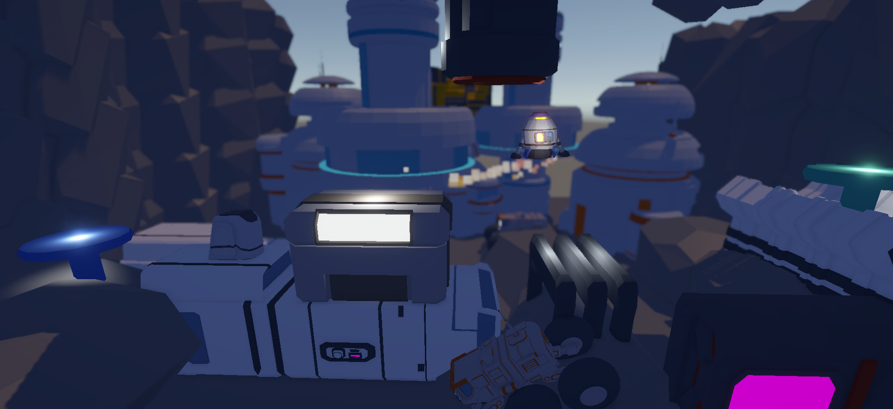
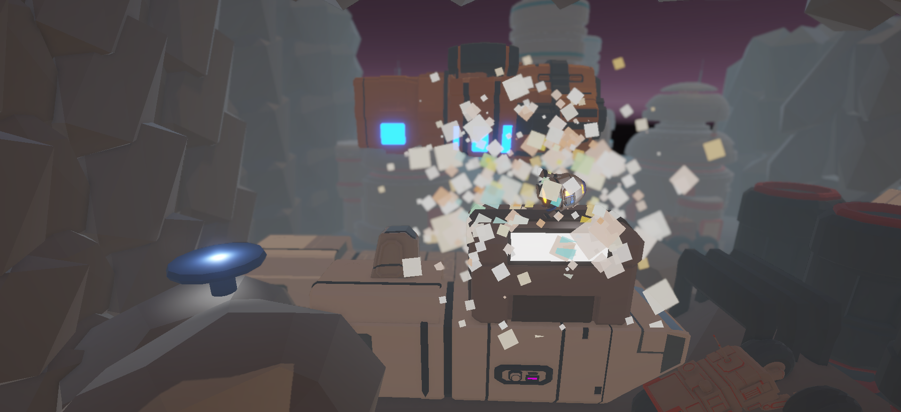

# RocketBoost

A physics-based rocket navigation game developed in Unity 6 using C#.

## Overview

RocketBoost is a physics-driven rocket control game where players navigate through obstacles and reach the finish platform while managing thrust and rotation.

This project focuses on Rigidbody physics, particle systems, audio feedback, collision handling, and level progression.

## Features

- Physics-Based Rocket Movement
- Rigidbody Controls
- Thrust System
- Rotation Controls
- Particle Effects
- Audio Feedback
- Collision Detection
- Success and Crash Sequences
- Level Progression
- Scene Management

## Technologies Used

- Unity 6
- C#
- Rigidbody Physics
- Particle Systems
- Audio Source
- Scene Management

## Screenshots

## Author

Bhavesh Kumar
